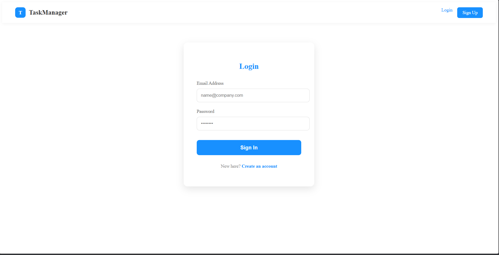
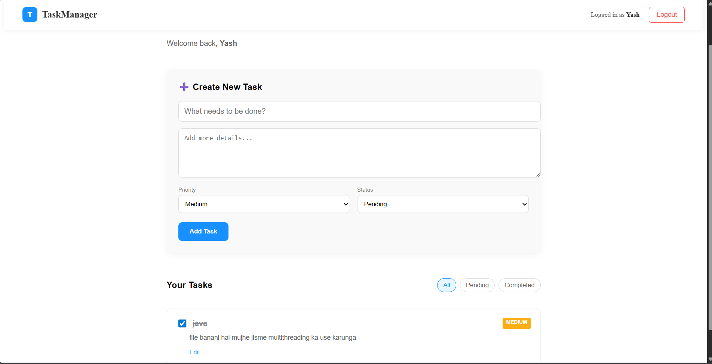
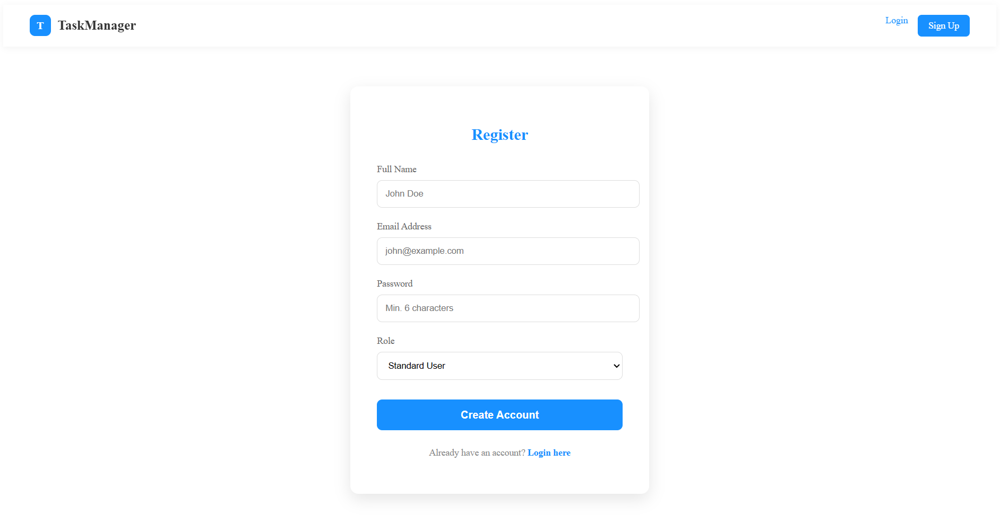

# 🚀 PrimetradeAI Backend Developer Internship Assignment

> **Secure. Scalable. Production-Ready.**
> A full-stack backend system built with modern best practices, featuring authentication, role-based access control, and clean API architecture.

---

## 🌟 Overview

This project demonstrates the design and implementation of a **secure, scalable RESTful API** with a minimal frontend interface for interaction.

It focuses on:

* Robust authentication & authorization
* Clean architecture & modular design
* Production-level coding standards

---

## 📸 Screenshots

| Login Page | Register Page |
| :---: | :---: |
|  |  |

| Dashboard |
| :---: |
|  |

---

## 🔐 Core Features

### 🧑‍💻 Authentication & Authorization

* User Registration & Login
* Password hashing using **bcrypt**
* JWT-based authentication
* Role-based access control (**User / Admin**)

---

### 📦 REST API (Task Management)

* Create, Read, Update, Delete tasks
* User-specific data isolation
* Admin-restricted actions
* Fully protected routes

---

### 🛡️ Security Implementation

* Secure JWT handling
* Input validation & sanitization
* Protected API endpoints
* Environment-based configuration

---

### ⚙️ Backend Engineering

* RESTful API design
* Proper HTTP status codes
* Centralized error handling
* API versioning (`/api/v1`)
* Scalable folder structure

---

### 🌐 Frontend (React)

* User Registration & Login UI
* JWT-based session handling
* Protected dashboard
* Task CRUD integration
* Real-time API response feedback

---

## 🧰 Tech Stack

| Layer    | Technology          |
| -------- | ------------------- |
| Backend  | Node.js, Express.js |
| Database | MongoDB (Mongoose)  |
| Auth     | JWT, bcrypt         |
| Frontend | React.js            |
| Tools    | Postman             |

---

## 📂 Project Structure

```bash
backend/
 ├── controllers/
 ├── models/
 ├── routes/
 ├── middleware/
 ├── config/
 └── server.js

frontend/
 ├── src/
 └── public/
```

---

## ⚡ Getting Started

### 🔧 Backend Setup

```bash
cd backend
npm install
npm start
```

---

### 🌐 Frontend Setup

```bash
cd frontend
npm install
npm start
```

---

## 🔑 Environment Variables

Create a `.env` file inside backend:

```env
PORT=5000
MONGO_URI=your_mongodb_connection
JWT_SECRET=your_secret_key
```

---

## 📬 API Endpoints

### 🔐 Auth

* `POST /api/v1/auth/register`
* `POST /api/v1/auth/login`

### 📦 Tasks

* `GET /api/v1/tasks`
* `POST /api/v1/tasks`
* `PUT /api/v1/tasks/:id`
* `DELETE /api/v1/tasks/:id` *(Admin only)*

---

## 📊 Scalability & Future Improvements

This system is designed with scalability in mind:

* 🔹 Microservices-ready architecture
* 🔹 Redis caching integration (future scope)
* 🔹 Load balancing via Nginx
* 🔹 Docker-based deployment support
* 🔹 Logging & monitoring (Winston, Prometheus)

---

## 🧠 Engineering Highlights

* Clean & modular code structure
* Separation of concerns
* Secure authentication flow
* Production-ready API design
* Easily extendable for new features

---

## 🎯 Why This Project Stands Out

✔ Follows **industry-level backend practices**
✔ Implements **real-world authentication & authorization**
✔ Designed with **scalability & security in mind**
✔ Demonstrates **full-stack integration**

---

## 👨‍💻 Author

**Rahul Raj Jaiswal**
Backend Developer | Problem Solver | Tech Enthusiast

---

## ⭐ Final Note

> This project is not just an assignment—
> it reflects my approach to building **secure, scalable, and production-ready systems**.
